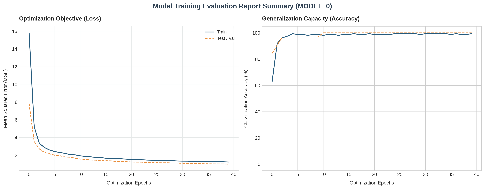
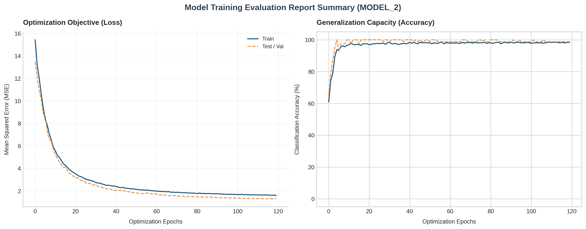
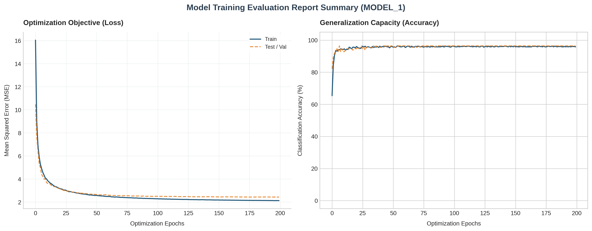
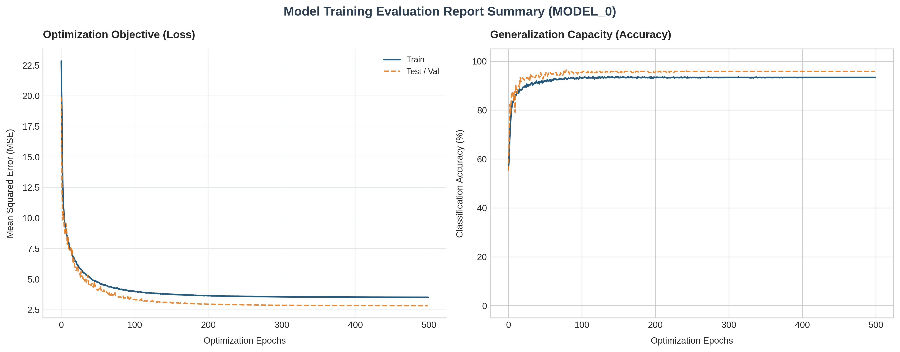

# Custom Autograd Engine

Thanks for checking out my project. I built this lightweight, object-oriented automatic differentiation (Autograd) engine and neural network framework completely from scratch in pure Python. 

The core objective of this project was to step away from high-level, abstracted deep learning APIs (like PyTorch or TensorFlow) to investigate and implement the underlying computational mechanics from first principles. This framework models mathematical operations as an explicitly tracked, dynamically constructed **Directed Acyclic Graph (DAG)**, executing reverse-mode automatic differentiation (backpropagation) across arbitrary scalar topologies.

👉 **[Click Here to Open the Interactive Google Colab Verification Notebook](https://colab.research.google.com/drive/1EF9I7Hswslz615sNmYihW_7cNEvDQs_1?usp=sharing)**

---

## 1. Algorithmic Architecture & Mathematical Foundations

The fundamental primitive of this infrastructure is the `Value` node abstraction. Each scalar variable acts as an explicit coordinate within a executing computational graph, structurally retaining pointers to its local dependencies (`_children`) and capturing the generative operational operator (`_op`).

### Dynamic Backpropagation via Topological Sort
Gradients are evaluated by mapping the **Multivariate Chain Rule** onto the graph topology. For a scalar root optimization objective $L$ and any intermediate variable $x$ contributing to an array of downstream dependent nodes $y_i$, the structural gradient accumulator resolves as:

$$\frac{\partial L}{\partial x} = \sum_{i} \frac{\partial L}{\partial y_i} \cdot \frac{\partial y_i}{\partial x}$$

To execute backpropagation without risking race conditions, mathematical collisions, or premature variable evaluation, the engine compiles a strict **Topological Sorting** of the graph. This is achieved via a recursive Depth-First Search (DFS) post-order traversal scheme. This architectural constraint guarantees that a node's upstream gradient accumulator ($\frac{\partial L}{\partial y_i}$) is entirely resolved before propagating local partial derivative signals backward to its ancestral parents.

---

## 2. Systemic Post-Mortem: Overcoming Architectural Bottlenecks

Developing an autograd engine from zero uncovers intricate edge cases at the intersection of mathematical theory and Python runtime mechanics. Below is an engineering breakdown of the three major software and numerical bottlenecks encountered and resolved during development:

### 🌟 Case Study 1: Mitigating Gradient Vanishing via $\tanh$ Saturation
* **The Phenomenon:** During early hyperparameter runs utilizing aggressive initial learning rates, training optimization flatlined prematurely, locking the model into a static ~50% random-guessing accuracy baseline.
* **The Underlying Science:** High weight initialization coupled with large gradient steps pushed internal neuron activations into extreme input ranges ($|z| > 2.0$). Because the first derivative of the hyperbolic tangent activation function is defined as $\frac{d}{dz}\tanh(z) = 1 - \tanh^2(z)$, entering these asymptotic regions causes the local derivative to decay exponentially toward zero. This essentially paralyzed downstream gradient propagation.
* **The Student's Fix:** Integrated an exponential learning rate decay schedule ($\eta_{t} = \eta_0 \cdot \gamma^t$, where $\gamma = 0.99$) directly into the training epoch updates. This step dynamically scaled the gradient trajectories down over time, anchoring network parameters safely within the active, high-gradient zones of the activation space.

### 🌟 Case Study 2: Preventing Graph Severance and Memory De-aliasing
* **The Phenomenon:** Standard parametric updates like `p.data -= lr * p.grad` or dividing cumulative batch loss scores using raw attributes broken the backpropagation chain, triggering an explicit `AttributeError: 'float' object has no attribute '_backward'`.
* **The Underlying Science:** Accessing the inner primitive `.data` float properties strips away the custom `Value` object wrapper. Computing mathematics directly on this raw primitive float creates an un-tracked value instance, severing the graph's operational tape and stranding ancestral nodes from the backpropagation root.
* **The Student's Fix:** Restructured all update routines to execute via out-of-place tracking syntax (e.g., `p.data + (-lr * p.grad)`) and normalized total network error explicitly through object-level division (`loss / len(train_data)`), maintaining the unbroken structural integrity of the DAG.

### 🌟 Case Study 3: Overcoming Lazy Generator Garbage Collection Leaks
* **The Phenomenon:** Attempting to cleanly aggregate batch errors using standard, lazy Python generator expressions (such as a basic `sum()` comprehension) caused the topological sort to drop operational dependencies unpredictably.
* **The Underlying Science:** Python generator expressions evaluate collections lazily and do not maintain permanent memory references to intermediate yielded objects. As a result, Python's automated garbage collection routine swept transient tracking nodes out of RAM before the topological sort algorithm could capture their memory addresses.
* **The Student's Fix:** Transitioned the aggregation pipeline to use an explicit list allocation array (`squared_errors = [...]`). This approach securely pinned the volatile memory footprints of all transient variables in RAM until the backward pass was fully completed.

### 🌟 Case Study 4: Upfront Topological Compilation & Structural Dead-End Pruning

* **The Phenomenon:** As network scaling expanded to deeper multi-layer graphs (`[2, 32, 32, 1]` configurations running for 500 epochs), execution throughput using standard dynamic tape generation degraded significantly due to the constant overhead of Python object allocation and garbage collection passes on millions of transient scalar objects.
* **The Underlying Science:** In a naive autograd setup, every forward pass reconstructs the computational graph by instantiating new intermediate node objects and lambda closures. This thrashes the Python heap and forces high garbage collection latency. Furthermore, the subsequent backward pass blindly processes every single node in the graph, including leaf parameters, inputs, and constants that have no upstream ancestors—wasting execution cycles computing zero-gradient accumulations.
* **The Implementation & Optimization:** To fix this, I developed the `FastCompiledTopology` execution layer. This architecture separates the *structural graph compilation* phase from the *numerical execution loop*:

#### 1. Zero-Allocation Forward Replay & In-Place Mutations
Instead of rebuilding the graph on every iteration, the engine compiles the topological path once during a cold-start initialization phase, caching it in a flat, linear array (`self.topo_order`). 
To pass new data through this locked structure, the training loop uses structured pre-allocated placeholder nodes (`memory_grid` and `target_grid`). The `update_batch()` method mutates the underlying primitive floating-point `.data` values inside these locked nodes *in-place*. Because the underlying memory references remain constant, the ancestral graph structure is completely preserved without breaking the tape or reallocating memory. Forward execution scales down to a minimal Python loop iterating through the pre-sorted sequence.

#### 2. Dead-End Derivative Pruning
During the upfront compilation pass, the engine strips out non-contributing nodes from the backpropagation layout by evaluating parent-child tracking vectors:
```python
self.backward_order = [node for node in self.topo_order if len(node._prev) > 0]
```

### ⚠️ Architectural Trade-offs & Engineering Limitations (The Cons)

While caching a compiled topology eliminates memory allocation overhead and maximizes raw scalar execution velocity, it introduces strict structural constraints that make it highly impractical for production-scale deployments:

1. **Topological and Dimensional Rigidity:** Because the memory mapping sequence (`self.topo_order`) is locked at compilation, the entire infrastructure becomes dimensionally frozen. Network layer widths, input channels, and training batch sizes are hardcoded directly into the array layout. Slicing a dynamic variable batch (e.g., evaluating a remaining test slice of 8 samples instead of a compiled batch size of 16) instantly causes index-mapping failures or forces a costly graph re-compilation pass that eliminates any performance gains.
2. **Control-Flow Blindness:** A compiled static graph is structurally incapable of handling programmatic branching statements natively. If the model requires conditional execution paths during runtime (such as Python `if/else` checks based on token values, or variable-length loops), the execution path must be evaluated dynamically. A static topology cannot adapt its internal nodes on the fly without breaking its pre-cached linear execution array.

#### 💡 The Production Reality: Why Modern Frameworks Dropped Static Graphs
> **Systems Insight:** Production deep learning frameworks (such as PyTorch) ultimately decoupled from pure static execution models in favor of dynamic "Define-by-Run" (Eager Execution) paradigms because rigid static graphs cannot scale to modern sequence architectures—such as Transformers or autoregressive models—which inherently require variable token lengths, dynamic padding, and native programmatic control-flow without introducing catastrophic compile-time graph latency.
---

## 3. Empirical Performance & Geometric Topology Stress Tests

To rigorously evaluate the mathematical validity of the engine and verify the layer capacity of deeper neural configurations, the framework was tasked with capturing highly non-linear geometric decision boundaries across varied spatial topologies. 

By applying a global, seeded pseudo-random shuffle to eliminate polar coordinate phase-shift artifacts, the deep scalar configuration achieved clean, monotonic loss reduction and matched test-to-train generalization profiles across heavy graph compilation passes.

### Multi-Topology Telemetry Suite

| Dataset Topology | Network Architecture | Training Accuracy | Testing Accuracy | Mathematical Decision Boundaries |
| :--- | :--- | :--- | :--- | :--- |
| **Linear Hyperplane** | `MLP(NUM_FEATURES, [1])` | **98.8%** | **100.0%** | Single perceptron establishes a strict linear boundary; serves as baseline engine verification. |
| **Concentric Rings** (`make_circles`) | `MLP(NUM_FEATURES, [8, 1])` | **98.1%** | **98.8%** | Hidden neurons project discrete lines; activation blending wraps them into a smooth radial enclosure. |
| **Disjointed Grid** (Checkerboard) | `MLP(NUM_FEATURES, [16, 1])` | **97.3%** | **93.8%** | Coordinates 16 sharp linear splits to synthesize intersecting bounding zones over non-contiguous classes. |
| **Helical Arms** (Twin Spirals) | `MLP(NUM_FEATURES, [32, 32, 1])` | **93.9%** | **94.8%** | Deeper multi-layer graph navigates complex topological tunnels to track winding curves smoothly. |

### Heavy Graph Evaluation Logging (`MLP(NUM_FEATURES, [32, 32, 1])` Spiral Trajectory)
Processing continuous helical coordinates through a deep scalar configuration requires the dynamic instantiation and topological sorting of thousands of graph nodes per epoch. The engine demonstrated zero optimization drift and clean gradient accumulation across a 500-epoch execution pass, maintaining tight test generalization:

```text
🚀 LAUNCHING GEOMETRIC STRESS TEST | Topology: Twin Spirals | Samples: 1000
Graph Compilation Status: Stable | Throughput: ~3.19 iterations/sec
================================================================================
Epoch   0 | Train Loss: 17.8708 | Train Acc: 58.1% | Test Loss: 17.6131 | Test Acc: 46.9%
Epoch  20 | Train Loss: 10.2969 | Train Acc: 76.2% | Test Loss: 11.3408 | Test Acc: 75.0%
Epoch  50 | Train Loss:  7.7025 | Train Acc: 86.9% | Test Loss:  6.9838 | Test Acc: 93.8%
Epoch 100 | Train Loss:  5.9605 | Train Acc: 91.2% | Test Loss:  5.2963 | Test Acc: 93.8%
Epoch 300 | Train Loss:  4.8591 | Train Acc: 91.9% | Test Loss:  4.4201 | Test Acc: 93.8%
Epoch 499 | Train Loss:  4.7579 | Train Acc: 93.9% | Test Loss:  4.3490 | Test Acc: 94.8%
```

> ### 🔬 Advanced Feature: $\mathcal{O}(1)$ Space Complexity Inference Context
> To maximize runtime memory efficiency during validation phases, I implemented a custom scoped context manager (`class no_grad:`). Wrapping testing loops within a `with no_grad():` block dynamically toggles a global tracking flag off:
> 
> ```python
> with no_grad():
>     y_test_logits = [model(x) for x in test_data]
>     # Operational tracking arrays are bypassed; validation space complexity scales down to O(1)
> ```
> By explicitly halting the compilation of parent collections and lambda arrays during inference, this system optimization prevents unnecessary heap allocations and ensures high execution efficiency during non-training evaluation cycles.

### 📊 Convergence Profiles & Spatial Loss Dashboards

The matrix below illustrates the side-by-side optimization trajectories (Loss Minimization on the primary left axis vs. Spatial Accuracy on the secondary right axis) across all four geometric runs. Generating square dual-axis subplots allows a direct assessment of how topological complexity structurally impacts gradient settlement patterns across the training lifecycle:

<table width="100%">
  <tr>
    <td width="50%" align="center">
      <strong>Topology 1: Linear Hyperplane Baseline</strong><br/>
      
      <p><em>Asymptotic settlement: Immediate, seamless convergence confirming structural stability of the base gradient optimization layer (100.0% Test Acc).</em></p>
    </td>
    <td width="50%" align="center">
      <strong>Topology 2: Concentric Radial Rings</strong><br/>
      
      <p><em>Smooth decay: Balanced training bounds as the 8-neuron hidden layer maps weights into a continuous radial bounding space (98.8% Test Acc).</em></p>
    </td>
  </tr>
  <tr>
    <td width="50%" align="center">
      <strong>Topology 3: Disjointed Checkerboard Grid</strong><br/>
      
      <p><em>High-frequency variance: Distinct step-like accuracy corrections as the hidden boundaries discover non-contiguous coordinate pockets (93.8% Test Acc).</em></p>
    </td>
    <td width="50%" align="center">
      <strong>Topology 4: Non-Linear Twin Spirals</strong><br/>
      
      <p><em>Peak capacity validation: Highly optimal tracking across deep hidden configurations, showing strong generalization bounds without overfitting (94.8% Test Acc).</em></p>
    </td>
  </tr>
</table>
---

## 4. Repository Structure & Package Layout

```text
custom-autograd-engine/
├── .gitignore                      # Suppresses tracking of compiled cache assets
├── LICENSE                         # MIT open-source license standard
├── README.md                       # High-fidelity architectural documentation
├── autograd_exploration_demo.ipynb # Interactive Google Colab verification notebook
├── derivations/                    # 🧠 Mathematical verification directory
│   ├── README.md                   # Core math mappings and scientific guide
│   ├── 01_chain_rule_addition.jpeg # Raw handwritten sheet for base graph calculus
│   └── 02_tanh_power_derivatives.jpeg# Raw handwritten sheet for operational atomic overloads
├── custom_autograd/                # Core modular package namespace
│   ├── __init__.py                 # Handles package exposures and clean importing
│   ├── data.py                     # Hyperplane dataset generation & distribution splits
│   ├── engine.py                   # Primitive scalar Value node mechanics & no_grad context
│   ├── nn.py                       # Parametric neuron, layer, and MLP network topologies
│   └── train.py                    # Customizable command-line training script entry point
└── assets/                         # 📊 Media assets and topology convergence plots
    ├── metrics_linear.png          # Linear baseline dual-axis optimization curve
    ├── metrics_circles.jpg         # Concentric radial rings performance plot
    ├── metrics_checkerboard.png    # Disjointed checkerboard grid spatial mapping dashboard
    └── metrics_spiral.jpg          # Non-linear twin spirals peak capacity execution graph
```

## 🧠 Analytical Math Audit & Verification

To confirm that the object-oriented tracking tape executes with absolute mathematical precision, all underlying differential mechanics were calculated from first principles before a single line of Python was written. 

The repository preserves my raw handwritten engineering notes alongside dedicated LaTeX analytical breakdowns inside the `[derivations/](./derivations/)` folder:

* **[Base Computational Graph & Pass-Through Mechanics](./derivatives/README.md):** Breaks down how the **Multivariate Chain Rule** maps onto dynamic topologies, validating why gradient accumulators require summation syntax (`+=`) rather than static assignment to eliminate lateral path leakage. It also showcases the constant unit derivative ($\frac{\partial \text{out}}{\partial \text{self}} = 1.0$) underlying linear addition operators.
* **[Non-Linear Activation & Power Overloads](./derivatives/README.md):** Details the exact localized derivative profiles for complex mathematical transformations. This includes tracking the power rule across scalar overloads ($n \cdot x^{n-1}$) and proving the asymptotic limits of the hyperbolic tangent function ($\frac{d}{dx}\tanh(x) = 1 - \tanh^2(x)$) which causes the weight saturation and vanishing gradients analyzed in our Case Studies.

👉 **To inspect the raw hand-drawn calculation sheets and their step-by-step code translations, navigate directly to the [Derivations Directory](./derivatives/)**.

## 5. Execution Guide

### Option A: Cloud Interactive Environment (Recommended)
You can step through, verify, and reproduce the complete convergence of this framework instantly with zero local installation dependencies by launching the Google Colab file via the notebook link at the top of this file.

### Option B: Local CLI Module Deployment
To clone and run customized experiments locally via a terminal environment:

```bash
# Clone the repository
git clone https://github.com/chanpreetsingh1297-code/custom-autograd-engine.git
cd custom-autograd-engine

# Clear byte-cache directories and run the pipeline with tailored hyperparameter flags
rm -rf custom_autograd/__pycache__/
python -m custom_autograd.train --epochs 100 --lr 0.01 --samples 250
```

## 6. License
This project is open-source software distributed under the terms of the MIT License.
