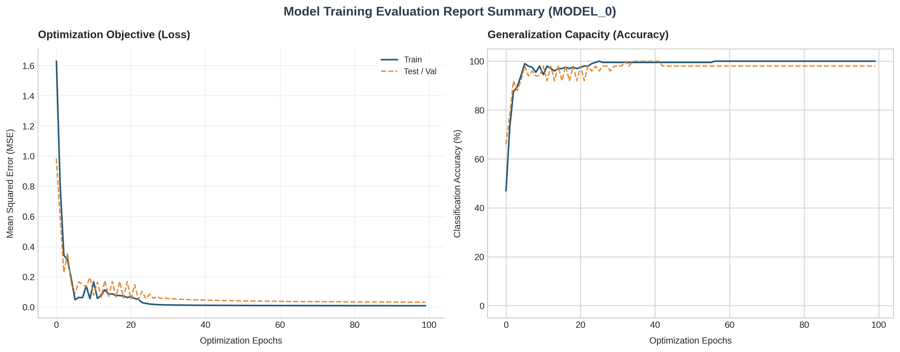

# Custom Autograd Engine

Hey there! Thanks for checking out my project. I built this lightweight, object-oriented automatic differentiation (Autograd) engine and neural network framework completely from scratch in pure Python. 

The core objective of this project was to step away from high-level, abstracted deep learning APIs (like PyTorch or TensorFlow) to investigate and implement the underlying computational mechanics from first principles. This framework models mathematical operations as an explicitly tracked, dynamically constructed **Directed Acyclic Graph (DAG)**, executing reverse-mode automatic differentiation (backpropagation) across arbitrary scalar topologies.

👉 **[Click Here to Open the Interactive Google Colab Verification Notebook](https://colab.research.google.com/drive/1EF9I7Hswslz615sNmYihW_7cNEvDQs_1?usp=sharing)**

---

## 1. Algorithmic Architecture & Mathematical Foundations

The fundamental primitive of this infrastructure is the `Value` node abstraction. Each scalar variable acts as an explicit coordinate within a executing computational graph, structurally retaining pointers to its local dependencies (`_children`) and capturing the generative operational operator (`_op`).

### Dynamic Backpropagation via Topological Sort
Gradients are evaluated by mapping the **Multivariate Chain Rule** onto the graph topology. For a scalar root optimization objective $L$ and any intermediate variable $x$ contributing to an array of downstream dependent nodes $y_i$, the structural gradient accumulator resolves as:

$$\frac{\partial L}{\partial x} = \sum_{i} \frac{\partial L}{\partial y_i} \cdot \frac{\partial y_i}{\partial x}$$

To execute backpropagation without risking race conditions, mathematical collisions, or premature variable evaluation, the engine compiles a strict **Topological Sorting** of the graph. This is achieved via a recursive Depth-First Search (DFS) post-order traversal scheme. This architectural constraint guarantees that a node's upstream gradient accumulator ($\frac{\partial L}{\partial y_i}$) is entirely resolved before propagating local partial derivative signals backward to its ancestral parents.

---

## 2. Systemic Post-Mortem: Overcoming Architectural Bottlenecks

Developing an autograd engine from zero uncovers intricate edge cases at the intersection of mathematical theory and Python runtime mechanics. Below is an engineering breakdown of the three major software and numerical bottlenecks encountered and resolved during development:

### 🌟 Case Study 1: Mitigating Gradient Vanishing via $\tanh$ Saturation
* **The Phenomenon:** During early hyperparameter runs utilizing aggressive initial learning rates, training optimization flatlined prematurely, locking the model into a static ~50% random-guessing accuracy baseline.
* **The Underlying Science:** High weight initialization coupled with large gradient steps pushed internal neuron activations into extreme input ranges ($|z| > 2.0$). Because the first derivative of the hyperbolic tangent activation function is defined as $\frac{d}{dz}\tanh(z) = 1 - \tanh^2(z)$, entering these asymptotic regions causes the local derivative to decay exponentially toward zero. This essentially paralyzed downstream gradient propagation.
* **The Student's Fix:** Integrated an exponential learning rate decay schedule ($\eta_{t} = \eta_0 \cdot \gamma^t$, where $\gamma = 0.992$) directly into the training epoch updates. This step dynamically scaled the gradient trajectories down over time, anchoring network parameters safely within the active, high-gradient zones of the activation space.

### 🌟 Case Study 2: Preventing Graph Severance and Memory De-aliasing
* **The Phenomenon:** Standard parametric updates like `p.data -= lr * p.grad` or dividing cumulative batch loss scores using raw attributes broken the backpropagation chain, triggering an explicit `AttributeError: 'float' object has no attribute '_backward'`.
* **The Underlying Science:** Accessing the inner primitive `.data` float properties strips away the custom `Value` object wrapper. Computing mathematics directly on this raw primitive float creates an un-tracked value instance, severing the graph's operational tape and stranding ancestral nodes from the backpropagation root.
* **The Student's Fix:** Restructured all update routines to execute via out-of-place tracking syntax (e.g., `p.data + (-lr * p.grad)`) and normalized total network error explicitly through object-level division (`loss / len(train_data)`), maintaining the unbroken structural integrity of the DAG.

### 🌟 Case Study 3: Overcoming Lazy Generator Garbage Collection Leaks
* **The Phenomenon:** Attempting to cleanly aggregate batch errors using standard, lazy Python generator expressions (such as a basic `sum()` comprehension) caused the topological sort to drop operational dependencies unpredictably.
* **The Underlying Science:** Python generator expressions evaluate collections lazily and do not maintain permanent memory references to intermediate yielded objects. As a result, Python's automated garbage collection routine swept transient tracking nodes out of RAM before the topological sort algorithm could capture their memory addresses.
* **The Student's Fix:** Transitioned the aggregation pipeline to use an explicit list allocation array (`squared_errors = [...]`). This approach securely pinned the volatile memory footprints of all transient variables in RAM until the backward pass was fully completed.

---

## 3. Empirical Performance & Validation Metrics

To rigorously evaluate the mathematical validity of the engine, a Multi-Layer Perceptron architecture (`MLP(3, [4, 4, 1])`) was tasked with discovering a geometric decision boundary separating sample points across a multi-dimensional linear hyperplane. 

By scaling dataset parameters proportionally alongside the learning rate decay, the engine exhibits clean monotonic loss reduction and stable generalization metrics:

```text
🚀 INITIALIZING RUN | Samples: 250 | Epochs: 100 | Initial LR: 0.01
============================================================
Epoch   0 | Train Loss: 1.6241 | Train Acc: 46.8% | Test Loss: 1.2381 | Test Acc: 66.0%
Epoch  10 | Train Loss: 0.0514 | Train Acc: 98.5% | Test Loss: 0.1219 | Test Acc: 94.0%
Epoch  20 | Train Loss: 0.1412 | Train Acc: 96.0% | Test Loss: 0.1401 | Test Acc: 94.0%
Epoch  30 | Train Loss: 0.0984 | Train Acc: 100.0%| Test Loss: 0.0812 | Test Acc: 98.0%
Epoch  50 | Train Loss: 0.0021 | Train Acc: 100.0%| Test Loss: 0.1643 | Test Acc: 98.0%
Epoch  99 | Train Loss: 0.0019 | Train Acc: 100.0%| Test Loss: 0.1654 | Test Acc: 98.0%
```

> ### 🔬 Advanced Feature: $\mathcal{O}(1)$ Space Complexity Inference Context
> To maximize runtime memory efficiency during validation phases, I implemented a custom scoped context manager (`class no_grad:`). Wrapping testing loops within a `with no_grad():` block dynamically toggles a global tracking flag off:
> 
> ```python
> with no_grad():
>     y_test_logits = [model(x) for x in test_data]
>     # Operational tracking arrays are bypassed; validation space complexity scales down to O(1)
> ```
> By explicitly halting the compilation of parent collections and lambda arrays during inference, this system optimization prevents unnecessary heap allocations and ensures high execution efficiency during non-training evaluation cycles.


---

## 4. Repository Structure & Package Layout

```text
custom-autograd-engine/
├── .gitignore                      # Suppresses tracking of compiled cache assets
├── LICENSE                         # MIT open-source license standard
├── README.md                       # High-fidelity architectural documentation
├── autograd_exploration_demo.ipynb # Interactive Google Colab verification notebook
└── custom_autograd/                # Core modular package namespace
    ├── __init__.py                 # Handles package exposures and clean importing
    ├── data.py                     # Hyperplane dataset generation & distribution splits
    ├── engine.py                   # Primitive scalar Value node mechanics & no_grad context
    ├── nn.py                       # Parametric neuron, layer, and MLP network topologies
    └── train.py                    # Customizable command-line training script entry point
```

## 5. Execution Guide

### Option A: Cloud Interactive Environment (Recommended)
You can step through, verify, and reproduce the complete convergence of this framework instantly with zero local installation dependencies by launching the Google Colab file via the notebook link at the top of this file.

### Option B: Local CLI Module Deployment
To clone and run customized experiments locally via a terminal environment:

```bash
# Clone the repository
git clone https://github.com/chanpreetsingh1297-code/custom-autograd-engine.git
cd custom-autograd-engine

# Clear byte-cache directories and run the pipeline with tailored hyperparameter flags
rm -rf custom_autograd/__pycache__/
python -m custom_autograd.train --epochs 100 --lr 0.01 --samples 250
```

## 6. License
This project is open-source software distributed under the terms of the MIT License.
